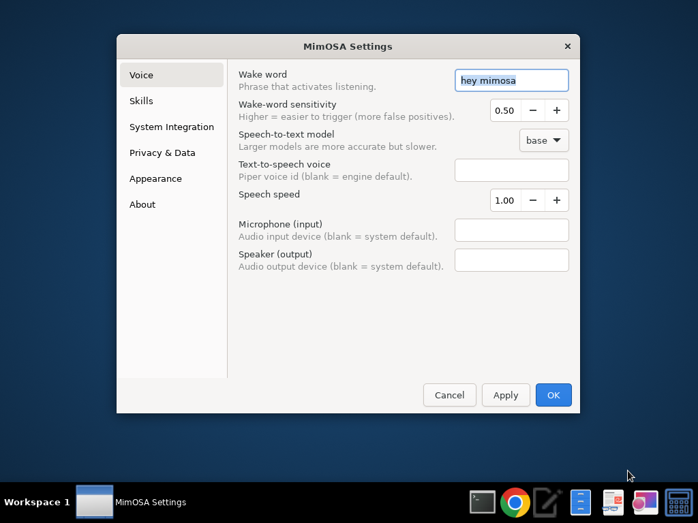

# MimOSA

**MimOSA** (Mimicking OS Assistant) — a privacy-focused, voice-controlled AI
assistant for Linux with personality and a local-first architecture.

MimOSA lives *in* your operating system: it controls apps, finds files, manages
system settings, and conducts research — all through natural conversation.
Unlike typical assistants, MimOSA keeps private conversations on your machine,
learns your preferences over time, and is designed so its language model can run
either in the cloud (Abacus.AI RouteLLM) or **fully locally** (Ollama,
llama.cpp) with no code changes.

> **Status:** **Phase 1 (Foundations) complete** — project scaffold + LLM
> abstraction (M1.1), local-first voice pipeline (M1.2), and the three-tier
> intent router with built-in skills (M1.3). **Phase 2 (System Integration) is
> complete:** **M2.1 — File Operations** (search/open/create/move/delete with a
> full safety sandbox), **M2.2 — Application Launching & System Control**
> (launch/close apps via the `.desktop` catalog, plus volume/brightness/Wi-Fi/
> battery), and **M2.3 — Kubuntu 26.04 Integration** (OS/hardware profiling, KDE
> Plasma D-Bus integration, hardware-aware optimization, and a voice
> `SystemInfoSkill`). **Phase 3 (UI & Avatar) is complete:** **M3.1 — GTK4 Window
> Design** adds an optional circular, always-on-top desktop **avatar** that
> animates with the assistant's state (idle / listening / processing /
> speaking), **M3.2 — Enhanced TTS / Lip-Sync** gives the avatar a mouth
> that syncs to spoken audio using **on-device** Piper phonemes (with an
> amplitude-envelope fallback), and **M3.3 — Settings & Preferences UI**
> completes the phase with a GTK4 multi-page settings dialog (Voice, Skills,
> System Integration, Privacy & Data, Appearance, About) backed by a unified,
> versioned, thread-safe config manager. **Phase 3 is complete.** Everything
> degrades gracefully to a full headless fallback, every setting is stored
> locally with **no telemetry**, and all **721 automated tests** pass offline.

---

## ✨ Core principles

| Principle | What it means |
|-----------|---------------|
| **Privacy first** | Sensitive data never leaves your machine; private conversations are encrypted and never sent to the cloud. |
| **Local-first** | All LLM calls flow through one abstraction layer, so a cloud model can be swapped for a local one via configuration. |
| **Token efficient** | Smart memory management minimizes API cost. |
| **Conversational UX** | Feels like talking to a friend, not issuing commands. |
| **Resource aware** | Transparent about system resource usage; degrades gracefully. |

---

## 📁 Project structure

```
osa_project/
├── mimosa/                 # Main package
│   ├── core/               # Agent loop & conversation state machine
│   ├── llm/                # LLM abstraction (Abacus + future local models)
│   ├── voice/              # Wake word, STT (Whisper), TTS (Piper)
│   ├── memory/             # Session, long-term, semantic & private memory
│   ├── skills/             # File ops, app launching, system control & info
│   ├── system/             # OS/hardware profiling, KDE integration, app registry
│   ├── ui/                 # GTK4 interface & 2D avatar (Phase 3)
│   └── utils/              # Logging & configuration helpers
├── data/                   # Local storage, models, indices (git-ignored)
├── scripts/                # Utility scripts (e.g. health_check.py)
├── tests/                  # Automated test suite
├── config/                 # Configuration files
├── docs/                   # Architecture & design docs
├── requirements.txt        # Phase 1 dependencies
├── .env.example            # Environment variable template
└── pytest.ini              # Test configuration
```

See [`docs/ARCHITECTURE.md`](docs/ARCHITECTURE.md) for a deep dive on the LLM
abstraction layer and how local-LLM support plugs in.

---

## 🚀 Setup

### Prerequisites

- **Python 3.10+** (developed and tested on 3.11)
- A Linux desktop (primary target: Kubuntu / Ubuntu 24.04+; adaptable to other
  distros)
- System library for audio capture:
  ```bash
  sudo apt install portaudio19-dev
  ```

### 1. Clone and enter the project

```bash
git clone https://github.com/servicefly/MimOSA.git
cd MimOSA
```

### 2. Create a virtual environment

```bash
python3 -m venv .venv
source .venv/bin/activate
```

### 3. Install dependencies

```bash
pip install -r requirements.txt
```

> `openai-whisper` pulls in PyTorch, which is a large download. The first run
> also downloads the Whisper and Piper voice models.

### 4. Configure your environment

```bash
cp .env.example .env
```

Then edit `.env` and set your values:

| Variable | Purpose |
|----------|---------|
| `ABACUS_API_KEY` | Your Abacus.AI key (required unless `USE_LOCAL_LLM=true`). |
| `USE_LOCAL_LLM` | `true` to force fully local inference (privacy mode). |
| `PORCUPINE_ACCESS_KEY` | Picovoice key for wake-word detection. |
| `LOG_LEVEL` | `DEBUG` / `INFO` / `WARNING` / `ERROR` / `CRITICAL`. |

### 5. Verify your environment

```bash
python scripts/health_check.py
```

This checks your Python version, dependency imports, Abacus.AI connectivity
(if a key is present), and prints system info.

---

## 🎙️ Voice pipeline (local-first)

MimOSA's entire voice stack runs **on-device** — spoken audio never leaves your
machine. Only (optional) LLM calls go to the cloud.

```
  IDLE ──(wake word)──▶ LISTENING ──(speech)──▶ PROCESSING ──(reply)──▶ SPEAKING ──▶ IDLE
   │                                                                                  ▲
   └──────────────────────────────────────────────────────────────────────────────-─┘
```

| Stage | Backend | Notes |
|-------|---------|-------|
| Wake word | [Porcupine](https://picovoice.ai/) | Dependency-free **energy fallback** if no key/package |
| Speech-to-text | [OpenAI Whisper](https://github.com/openai/whisper) | Fully local; model set by `WHISPER_MODEL` |
| Text-to-speech | [Piper](https://github.com/rhasspy/piper) | Fully local; voice set by `PIPER_VOICE` |

### Voice configuration

Set these in your `.env` (see `.env.example`):

| Variable | Default | Purpose |
|----------|---------|---------|
| `WAKE_WORD` | `hey mimosa` | Activation phrase |
| `PORCUPINE_ACCESS_KEY` | — | Picovoice key (optional; falls back to energy detector) |
| `WHISPER_MODEL` | `base` | `tiny`/`base`/`small`/`medium`/`large` (+ `.en`) |
| `PIPER_VOICE` | `en_US-lessac-medium` | Piper voice name or `.onnx` path |
| `AUDIO_INPUT_DEVICE` | `default` | Mic device index or `default` |
| `AUDIO_OUTPUT_DEVICE` | `default` | Speaker device index or `default` |

### Trying it out

```bash
# Report which backends are available (no recording):
python scripts/test_voice_loop.py --check

# List audio devices:
python scripts/test_voice_loop.py --list-devices

# Single turn, push-to-talk (no wake word needed):
python scripts/test_voice_loop.py --once --no-wake

# Continuous, wake-word driven:
python scripts/test_voice_loop.py
```

> **Heads-up:** On a headless VM (no microphone/speakers) the voice modules
> import fine and the tester reports backends as unavailable instead of
> crashing. Real voice I/O requires a desktop with audio hardware (e.g.
> Kubuntu) and `sudo apt install portaudio19-dev`. See
> [`docs/VOICE_PIPELINE.md`](docs/VOICE_PIPELINE.md) for the full guide.

---

## 🧠 Intent system (routing & skills)

Once your words are transcribed, MimOSA decides **what you want** and hands the
request to the right *skill*. To keep things fast, private, and cheap, routing
is **hybrid**:

```
  text ─▶ Tier 1: local regex heuristics ─▶ (confident?) ─▶ skill
                       │ no                              ▲
                       ▼                                 │
            Tier 1b: question-shape check ───────────────┤
                       │ no                               │
                       ▼                                  │
            Tier 2: LLM classification ──────────────────┘
```

* **Tier 1 (local, zero-cost):** regex heuristics catch time, date, math,
  weather, and greetings instantly — **no LLM call**.
* **Tier 1b:** question-shaped utterances (who/what/why… or ending in `?`) are
  routed straight to the question skill, which needs the LLM to *answer*
  anyway — so we skip a redundant classification call.
* **Tier 2 (LLM):** only genuinely ambiguous input is sent to the LLM for
  classification. Low-confidence results fall back to the general question
  skill.

### Skills

| Intent | Skill | LLM? | What it does |
|--------|-------|:----:|--------------|
| `time` / `date` | `TimeSkill` | ❌ local | Current time, date, day of week |
| `calculator` / `math` | `CalculatorSkill` | ❌ local | Safe arithmetic (AST allow-list, **no `eval`**) |
| `weather` | `WeatherSkill` | ❌ local | Live conditions via [wttr.in](https://wttr.in) (no API key) |
| `greeting` / `chitchat` | `GreetingSkill` | ✅ cloud | Friendly small talk (local fallback if offline) |
| `question` | `QuestionSkill` | ✅ cloud | General-knowledge Q&A, concise & voice-friendly |
| `file_ops` / `file` | `FileOperationsSkill` | ❌ local | **(M2.1)** Search, open, create, move, delete files/folders — sandboxed to your home dir |
| `application` / `app_launch` | `ApplicationSkill` | ❌ local | **(M2.2)** Launch / list / query / close desktop apps via the `.desktop` catalog |
| `system_control` / `system` | `SystemControlSkill` | ❌ local | **(M2.2)** Volume, screen brightness, Wi-Fi, and battery — with graceful degradation |
| `system_info` | `SystemInfoSkill` | ❌ local | **(M2.3)** Answer questions about your OS, desktop, display server, KDE Plasma version, and CPU/RAM/GPU/audio |

> **Privacy:** local skills never touch the network. LLM-backed skills send
> only the **transcribed text** — never audio. Every skill degrades gracefully:
> a failure returns a spoken apology, never an unhandled crash.

### Intent configuration

Set these in your `.env` (see `.env.example`):

| Variable | Default | Purpose |
|----------|---------|---------|
| `INTENT_CONFIDENCE_THRESHOLD` | `0.7` | Below this, route to the question skill |
| `MAX_CONVERSATION_HISTORY` | `10` | Turns of context kept for LLM skills |
| `DEFAULT_LOCATION` | — | Fallback city for weather when none is said |
| `WEATHER_API_KEY` | — | Reserved (wttr.in needs none today) |

### Trying it out

```bash
# Run example utterances for every intent type (uses the real LLM if available):
python scripts/test_intents.py --demo

# Interactive: type utterances and see classification + reply:
python scripts/test_intents.py

# Check the router + LLM are reachable:
python scripts/test_intents.py --check

# Full pipeline, simulated (no microphone needed — type instead of speak):
python scripts/test_full_loop.py --simulate

# Full pipeline on a real desktop (wake word ▶ STT ▶ intent ▶ LLM ▶ TTS):
python scripts/test_full_loop.py --once
```

See [`docs/INTENT_SYSTEM.md`](docs/INTENT_SYSTEM.md) for the full design,
extension guide, and troubleshooting.

---

## 🗂️ File operations (M2.1 — system integration)

MimOSA's first **system integration** skill lets you manage files by voice while
a strict safety layer keeps the assistant inside your personal space.

| You say | MimOSA does |
|---------|-------------|
| "Find my budget spreadsheet" | Case-insensitive name/type search across your home folder |
| "Find my photos" | Filters by file-type category (images, documents, audio, video…) |
| "Open report.pdf" | Launches it with the desktop default app (`xdg-open`) |
| "Create a folder called Taxes" | Makes an empty directory |
| "Create a file called notes.txt in Projects" | Creates a file (optionally inside a folder) |
| "Move report.txt to Documents" | Moves/renames, with conflict detection |
| "Delete old-notes.txt" | **Asks to confirm**, then moves it to the **Trash** (recoverable) |
| "Permanently delete junk.txt" | **Asks to confirm**, then deletes for good |

**Safety guardrails (always on):**

- **Home-directory sandbox.** Operations are confined to `$HOME` (plus a few
  scratch/removable mounts). Anything outside is refused.
- **System blacklist.** `/etc`, `/bin`, `/sys`, `/proc`, `/boot`, `/usr`, … are
  *never* touched, even via symlinks or `..` traversal (paths are fully resolved
  first).
- **Confirmation for destructive actions.** Deletes and overwriting moves are
  two-step: MimOSA describes the action and waits for "yes"/"no".
- **Trash by default.** Deletes go to the Trash via
  [`send2trash`](https://pypi.org/project/Send2Trash/) so mistakes are
  recoverable; permanent deletion is opt-in.
- **Sensitive dotfiles** (`~/.ssh`, `~/.config`, `~/.gnupg`, …) get extra
  caution before any destructive op.

All operations are **100 % local** — nothing is sent to the cloud. The safety
logic lives in [`mimosa/system/file_safety.py`](mimosa/system/file_safety.py)
and the skill in [`mimosa/skills/file_ops.py`](mimosa/skills/file_ops.py). See
[`docs/FILE_OPERATIONS.md`](docs/FILE_OPERATIONS.md) for the full design.

---

## 🚀 Application launching & system control (M2.2 — system integration)

MimOSA can now open and manage your apps, and adjust low-level system state —
all **100 % locally**, with no cloud calls.

### Applications

| You say | MimOSA does |
|---------|-------------|
| "Open Firefox" / "Launch the text editor" | Resolves the name against the installed `.desktop` catalog (fuzzy-matched) and launches it, detached |
| "What browsers do I have?" | Lists apps by freedesktop category |
| "Is Firefox running?" | Checks live processes via `psutil` |
| "Close Firefox" | **Asks to confirm**, then ends it gracefully (`SIGTERM` → `SIGKILL` fallback) |

Apps are discovered by parsing `.desktop` files from
`~/.local/share/applications`, `/usr/share/applications`, and the other standard
locations — malformed/hidden entries are skipped, and lookups tolerate imperfect
speech-to-text ("fire fox" → Firefox).

### System control

| You say | MimOSA does |
|---------|-------------|
| "Turn the volume up" / "Set volume to 30 percent" / "Mute" | Adjusts audio (`wpctl` → `pactl` → `amixer`) |
| "Brightness down" / "Set brightness to 70 percent" | Adjusts the screen (`brightnessctl` → `xbacklight`) |
| "Turn Wi-Fi off" | **Asks to confirm** (it disconnects you), then `nmcli radio wifi off` |
| "Is my Wi-Fi on?" / "Turn Wi-Fi on" | Reports / enables Wi-Fi |
| "How much battery do I have left?" | Reads `/sys/class/power_supply` directly |

**Graceful degradation:** each command probes for an available backend with
`shutil.which`. If the underlying tool isn't installed, MimOSA says so clearly
instead of crashing. Disruptive changes (closing an app, turning Wi-Fi off) are
confirmed first; reversible ones (volume/brightness) act immediately.

The logic lives in
[`mimosa/system/app_registry.py`](mimosa/system/app_registry.py),
[`mimosa/system/system_control.py`](mimosa/system/system_control.py),
[`mimosa/skills/application.py`](mimosa/skills/application.py), and
[`mimosa/skills/system_control.py`](mimosa/skills/system_control.py). See
[`docs/APPLICATION_CONTROL.md`](docs/APPLICATION_CONTROL.md) for the full design
and the optional system dependencies.

---

## 🐧 Kubuntu 26.04 integration (M2.3 — system integration)

MimOSA is now **aware of the machine it runs on** and adapts to it — entirely
locally. Nothing about your hardware or OS is ever sent to the cloud.

### Ask about your system

| You say | MimOSA tells you |
|---------|------------------|
| "What desktop am I using?" / "Is this Wayland or X11?" | Desktop environment & display server |
| "What version of Plasma?" | KDE Plasma version |
| "What operating system is this?" | Distro & whether it's Kubuntu |
| "Show me my system specs" | Combined OS + hardware summary |
| "What audio backend am I using?" / "Do I have a microphone?" | Audio stack & capture devices |
| "How much RAM / what CPU / what graphics card do I have?" | The relevant hardware fact |
| "What settings do you recommend for this machine?" | Hardware-aware tuning |

### Under the hood

* **System profiling** — distro, version, desktop environment, **Wayland/X11**,
  KDE Plasma version, architecture & kernel (from `/etc/os-release`, XDG
  variables, and `platform`).
* **Hardware detection** — audio backend (**PipeWire → PulseAudio → ALSA**),
  displays & multi-monitor, microphones, CPU, RAM, and GPU (via `psutil`,
  `/proc`, `/sys`, `lspci`, `xrandr`, `pactl`).
* **KDE integration** — desktop **notifications**, **virtual desktops**, and
  **KDE Connect** over D-Bus (`dbus-python` or `qdbus`), with a non-KDE-safe
  fallback that simply no-ops.
* **System optimization** — picks the audio backend, **Whisper model size**,
  TTS quality, wake-word sensitivity, and conversation-history limit from the
  machine's performance tier.

**Graceful degradation everywhere:** on a non-Kubuntu host, a GNOME session, or
a box without D-Bus/`lspci`/`xrandr`, every detector returns a partial-but-honest
result rather than crashing — which is exactly why the whole feature is testable
off-target. `python scripts/health_check.py` prints a full profile plus a
**Kubuntu 26.04 / KDE compatibility** report.

The logic lives in
[`mimosa/system/system_profiler.py`](mimosa/system/system_profiler.py),
[`mimosa/system/hardware_detector.py`](mimosa/system/hardware_detector.py),
[`mimosa/system/kde_integration.py`](mimosa/system/kde_integration.py),
[`mimosa/system/system_optimizer.py`](mimosa/system/system_optimizer.py), and
[`mimosa/skills/system_info.py`](mimosa/skills/system_info.py). See
[`docs/KUBUNTU_INTEGRATION.md`](docs/KUBUNTU_INTEGRATION.md) for the full design,
hardware requirements, and optional dependencies.

---

## 🪟 Desktop avatar (M3.1 — UI & avatar)

MimOSA gets an optional **desktop presence**: a small, circular,
**frameless, transparent, always-on-top** window that animates with the
assistant's state.

- **Visual states** — IDLE (breathing glow), LISTENING (expanding rings),
  PROCESSING (thinking dots), SPEAKING (audio-reactive level bar), each
  color-coded by theme with smooth eased transitions. Drawn procedurally with
  **Cairo** (no raster assets required).
- **Window** — draggable (position is persisted), right-click menu
  (Settings / Hide / Quit), Escape to hide, multi-monitor aware, Wayland/X11
  compatible (best-effort positioning on strict Wayland).
- **Thread-safe** — the voice loop runs on a worker thread; a `StateBridge`
  marshals state changes onto the GTK main thread via `GLib.idle_add`. A UI
  fault can never crash the voice loop.
- **Optional & private** — runs **headless** (voice/CLI, no GTK imported) when
  no display or GTK 4 is available, or with `--no-gui`. No telemetry;
  preferences live in `~/.config/mimosa/ui.json`.

```bash
python -m mimosa.ui.app --check     # report GUI/headless readiness
python -m mimosa.ui.app --no-gui    # force headless
python -m mimosa.ui.app             # GUI if available, else headless
```

Implemented in [`mimosa/ui/`](mimosa/ui/) —
[`app.py`](mimosa/ui/app.py), [`avatar_window.py`](mimosa/ui/avatar_window.py),
[`avatar_renderer.py`](mimosa/ui/avatar_renderer.py),
[`state_bridge.py`](mimosa/ui/state_bridge.py),
[`window_manager.py`](mimosa/ui/window_manager.py),
[`ui_config.py`](mimosa/ui/ui_config.py),
[`environment.py`](mimosa/ui/environment.py). See
[`docs/UI_ARCHITECTURE.md`](docs/UI_ARCHITECTURE.md) for the full design,
threading model, and GTK4 install instructions for Kubuntu 26.04.

---

## 👄 Lip-sync (M3.2 — enhanced TTS / viseme sync)

The avatar can now **move its mouth in time with speech**, entirely on-device.

- **On-device phonemes** — `PiperTTS.synthesize_with_visemes(text)` returns the
  WAV **and** a `VisemeTimeline` built from the local Piper/eSpeak engine's
  phonemes. No network, no third-party phoneme/viseme services.
- **Robust fallback chain** — timed phonemes → estimated timing from phoneme
  strings → **amplitude-envelope** visemes straight from the audio → empty
  timeline (the M3.1 speaking bar). Extraction is wrapped so it **never** raises
  into the voice loop; the audio is always returned.
- **10 visemes + silence** — a compact `Viseme` set maps IPA/ASCII phonemes to
  mouth shapes (bilabial, labiodental, rounded, open, …), animated with
  frame-rate-independent easing and drawn with Cairo bezier curves.
- **Tunable & optional** — `lipsync_enabled`, `viseme_speed`, `mouth_style`
  (`natural`/`cartoon`/`minimal`), `lipsync_latency`, and `lipsync_debug` live in
  the UI config. Works headless: with no Cairo/display the mouth draw is a no-op
  and speech is unaffected.

Implemented in [`mimosa/ui/viseme_mapper.py`](mimosa/ui/viseme_mapper.py),
[`mimosa/voice/phoneme_extractor.py`](mimosa/voice/phoneme_extractor.py),
[`mimosa/ui/audio_sync.py`](mimosa/ui/audio_sync.py),
[`mimosa/ui/mouth_animator.py`](mimosa/ui/mouth_animator.py) (plus
`tts.py` / `avatar_renderer.py` updates). See
[`docs/VISEME_SYSTEM.md`](docs/VISEME_SYSTEM.md) for the mapping table, timing
model, and fallback chain.

---

## ⚙️ Settings & preferences (M3.3 — settings UI)

Every preference is editable from a **multi-page GTK4 settings dialog**, opened
from the avatar's right-click menu, with the keyboard shortcut **Ctrl + ,**
(the conventional "Preferences" accelerator), or programmatically. The dialog is
modal to the avatar and offers **Apply / Cancel / OK** with live preview of UI
changes.

| Page | What you can tune |
|------|-------------------|
| **Voice** | Wake word + sensitivity, speech-to-text model, TTS voice & speed, input/output audio devices |
| **Skills** | Enable/disable each skill and reorder their **priority** (top = matched first) |
| **System Integration** | Toggle file operations / app control / system controls, **safe mode**, and per-action confirmation prompts |
| **Privacy & Data** | LLM provider (`abacus` / `local` / **`none`** = fully offline), conversation-history limit, retention, **clear history**, and a live privacy summary |
| **Appearance** | Avatar size, opacity, color scheme, animation style/speed, always-on-top, lip-sync, mouth style |
| **About** | Version, system summary, license, and credits |

All settings persist to a single local JSON file
(`~/.config/mimosa/settings.json`, override with `MIMOSA_CONFIG`) via a
**unified, versioned, thread-safe** config manager
([`mimosa/utils/config.py`](mimosa/utils/config.py)). The manager migrates older
config layouts automatically and mirrors UI preferences back to the legacy
`ui.json` for backward compatibility. **Nothing is ever sent off the
device — there is no telemetry.**

The dialog is a thin GTK view over a fully **headless-testable controller**
([`mimosa/ui/settings_logic.py`](mimosa/ui/settings_logic.py)); the GTK window
itself lives in
[`mimosa/ui/settings_dialog.py`](mimosa/ui/settings_dialog.py). See
[`docs/USER_GUIDE.md`](docs/USER_GUIDE.md) for a full walkthrough (with
screenshots) and [`docs/UI_ARCHITECTURE.md`](docs/UI_ARCHITECTURE.md) for the
design.



---

## 🧪 Running tests

```bash
pytest
```

The setup tests validate the directory structure, config files, importable
dependencies, and the LLM provider factory. They run offline and require no API
key.

---

## 🤝 Contributing

See [`CONTRIBUTING.md`](CONTRIBUTING.md) for the branching model, commit
conventions, and workflow.

---

## 📄 License

MIT — see [`LICENSE`](LICENSE).
