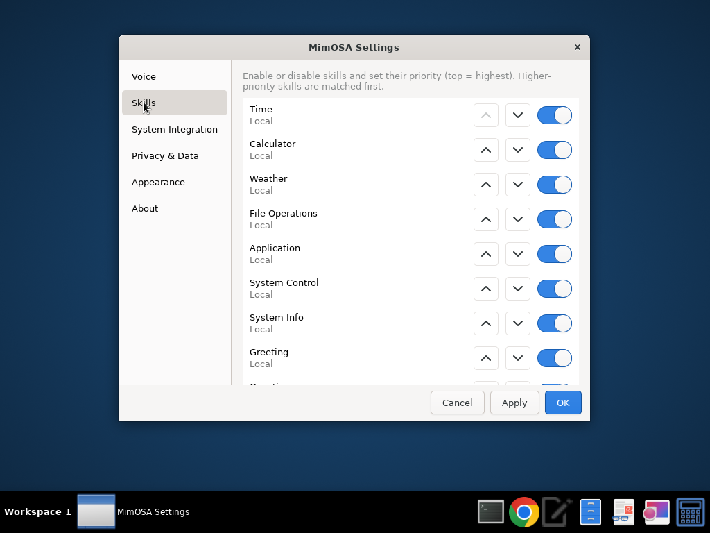
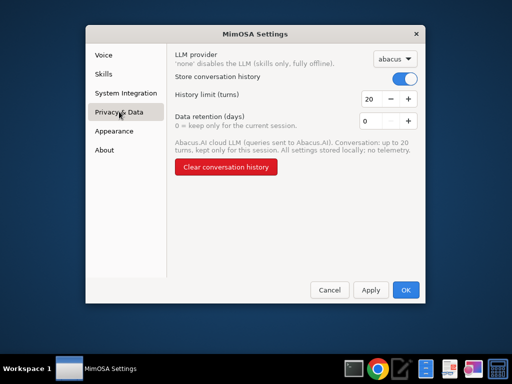

# MimOSA User Guide — Settings & Preferences

This guide walks through MimOSA's **Settings & Preferences** dialog (M3.3) and
explains every option. MimOSA is **privacy-first**: every setting below is
stored **locally** on your machine and **nothing is ever sent off the
device** — there is no telemetry of any kind.

---

## Opening Settings

You can open the settings dialog three ways:

1. **Right-click the avatar** → choose **Settings**.
2. Press **Ctrl + ,** while the avatar is focused (the standard "Preferences"
   shortcut on Linux/GNOME/KDE).
3. Programmatically, via `MimOSAApplication._on_settings()` (used internally).

The dialog is **modal** to the avatar window. Each page is reachable from the
sidebar on the left. Your edits are held in a working copy and are **not saved
until you press Apply or OK**:

| Button | Effect |
|--------|--------|
| **Apply** | Save all changes to disk; keep the dialog open. |
| **OK** | Save all changes and close the dialog. |
| **Cancel** | Discard all unsaved changes and close. |

If you change a setting that only takes effect on the next launch (for example
the speech-to-text model or the wake word), a small banner appears at the top:
*"Some changes will take effect after restarting MimOSA."*

---

## Dialog layout (mockup)

```
┌───────────────────────────── MimOSA Settings ──────────────────────────────┐
│  Some changes will take effect after restarting MimOSA.   (shown if needed) │
│ ┌───────────────┐ ┌───────────────────────────────────────────────────────┐│
│ │ ▸ Voice       │ │  Wake word                         [ hey mimosa      ] ││
│ │   Skills      │ │  Phrase that activates listening.                      ││
│ │   System      │ │  Wake-word sensitivity                  [ 0.50 ] [-][+]││
│ │     Integration│ │  Speech-to-text model                   [ base   ▾ ] ││
│ │   Privacy &   │ │  Text-to-speech voice              [               ] ││
│ │     Data      │ │  Speech speed                           [ 1.00 ] [-][+]││
│ │   Appearance  │ │  Microphone (input)                [               ] ││
│ │   About       │ │  Speaker (output)                  [               ] ││
│ └───────────────┘ └───────────────────────────────────────────────────────┘│
│                                           [ Cancel ]  [ Apply ]  [  OK  ]   │
└─────────────────────────────────────────────────────────────────────────────┘
```

Screenshots of the real dialog:

| Voice | Skills | Privacy & Data |
|-------|--------|----------------|
|  |  |  |

---

## Voice

Controls the speech pipeline.

- **Wake word** — the phrase that activates listening (default *"hey mimosa"*).
  *Takes effect after restart.*
- **Wake-word sensitivity** (0.0–1.0) — higher values trigger more easily but
  cause more false activations.
- **Speech-to-text model** — Whisper model size (`tiny` → `large`). Larger
  models are more accurate but slower and use more memory. *Takes effect after
  restart.*
- **Text-to-speech voice** — the Piper voice id. Leave blank to use the engine
  default.
- **Speech speed** (0.5–2.0) — playback rate of synthesized speech.
- **Microphone (input)** / **Speaker (output)** — audio device names. Leave
  blank to use the system defaults. *Take effect after restart.*

> If Whisper, Piper, or audio hardware aren't installed, MimOSA still runs and
> these options are saved for when they are — nothing crashes.

---

## Skills

Lists every registered skill in **priority order** (top = highest). Higher
priority skills are matched first when an utterance is ambiguous.

- The **switch** on each row enables or disables that skill.
- The **▲ / ▼ buttons** move a skill up or down in priority.
- Each row notes whether the skill runs **locally** or **uses the LLM**.

Disabling a skill removes it from intent matching without uninstalling
anything. (Custom user-added skills are a planned extension — the data model
already reserves a slot for them.)

---

## System Integration

Safety toggles that govern what MimOSA may do on your computer.

- **Allow file operations** — create, move, search, and delete files on request.
- **Allow application control** — launch and focus applications.
- **Allow system controls** — volume, brightness, lock, and similar.
- **Safe mode** *(recommended)* — forces a confirmation prompt before any
  destructive or system-level action. While safe mode is on, the
  "Confirm destructive actions" and "Confirm system controls" options are kept
  on automatically.
- **Confirm destructive actions** — ask before deleting or overwriting.
- **Confirm app launches** — ask before opening an application.
- **Confirm system controls** — ask before changing volume/brightness/etc.

Turning a capability **off** means MimOSA will decline those requests entirely —
a hard, local guardrail.

---

## Privacy & Data

- **LLM provider:**
  - `abacus` — uses the Abacus.AI cloud LLM (your queries are sent to
    Abacus.AI).
  - `local` — uses an on-device LLM; nothing leaves your machine.
  - `none` — **disables the LLM entirely.** MimOSA runs skills-only and is
    fully offline. *Takes effect after restart.*
- **Store conversation history** — when off, no turns are retained in memory.
- **History limit (turns)** — how many recent turns to keep for context
  (1–500).
- **Data retention (days)** — `0` means history is kept only for the current
  session (the default; history is never written to disk by default).
- **Clear conversation history** — immediately drops all retained turns. The
  dialog reports how many were cleared.

A **live privacy summary** at the bottom of the page describes your current
posture in one sentence, e.g. *"No LLM (skills-only; fully offline).
Conversation: history disabled. All settings stored locally; no telemetry."*

---

## Appearance

Avatar look-and-feel. Changes here are **previewed live** on the avatar when you
press Apply — no restart needed.

- **Avatar size** (80–600 px) and **Opacity** (0.1–1.0).
- **Color scheme** — `aurora` (default), `ember`, or `mono` (accessible
  grayscale).
- **Animation style** — `pulse`, `rings`, `waveform`, or `minimal` — and
  **Animation speed** (0.1–5.0).
- **Enable animations** and **Always on top**.
- **Lip-sync (mouth animation)** and **Mouth style** (`natural` / `cartoon` /
  `minimal`).

> A separate "reset avatar position" action recenters the window if you've
> dragged it off-screen.

---

## About

Shows the MimOSA version, a one-line summary of your detected system (distro,
desktop, display server), the author, the MIT license, and credits. A
"check for updates" action is reserved for a future release.

---

## Where settings are stored

All preferences live in a single JSON file:

```
~/.config/mimosa/settings.json
```

You can point MimOSA at a different file with the `MIMOSA_CONFIG` environment
variable (handy for testing or multiple profiles). The file is written
**atomically** and **migrated automatically** if its layout changes between
versions, so an interrupted save or an old config can never break startup. UI
preferences are also mirrored to the legacy `~/.config/mimosa/ui.json` for
backward compatibility.

Because everything is a plain local file, you can back it up, version-control
it, or hand-edit it — out-of-range values are clamped to safe bounds on the next
load rather than rejected.

---

## Running headless

If you start MimOSA without a display (or without GTK 4 installed), it runs in
**voice/CLI mode** and the settings dialog is simply unavailable. All of your
saved settings are still honored, and you can edit `settings.json` directly.
